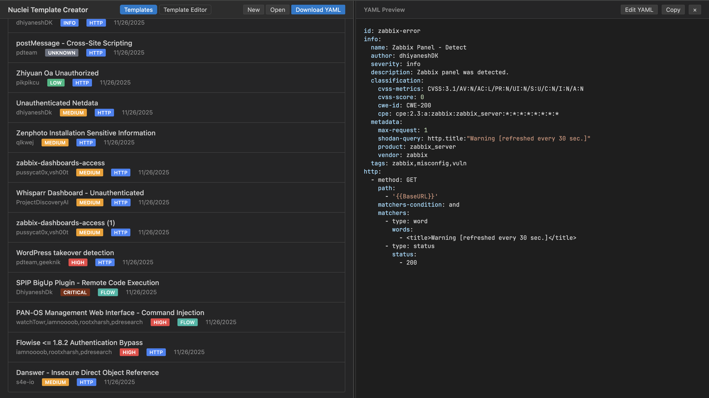
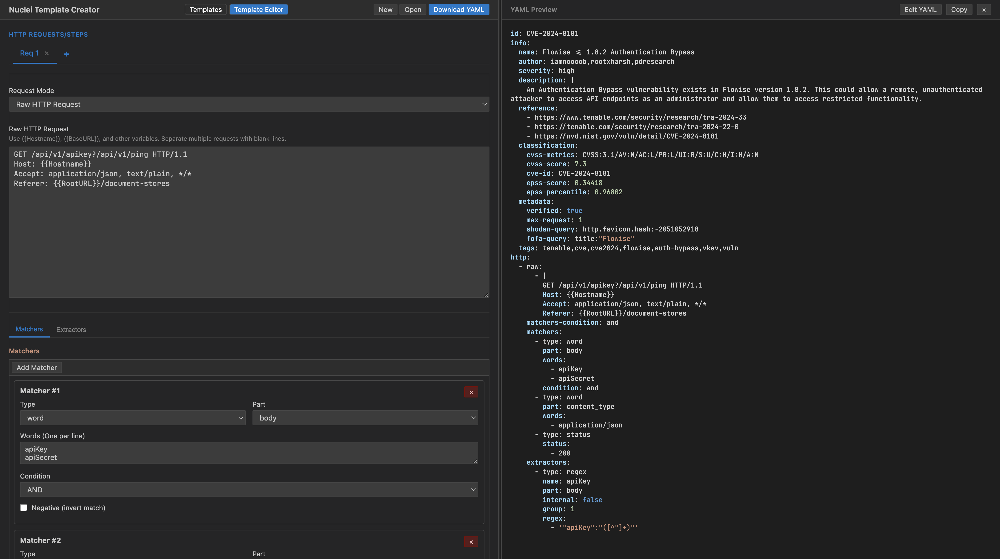

# Nuclei Template Creator

A modern, **premium‑looking** web UI for creating and editing Nuclei templates.  It supports:

- **Standard HTTP requests** (method, path, body, headers)
- **Raw HTTP request** editing
- **DAST fuzzing mode** – full rule editor with parts, types, modes, payloads, pre‑conditions, attack types and analyzers
- **Import / Open** – import one or many `.yaml` files, automatically open the first imported template and prompt to discard unsaved changes
- **Matchers & Extractors** – dynamic UI that adapts to the selected type
- **Template manager** – list, duplicate, delete, download, and bulk download templates
- **Live YAML preview** with syntax highlighting and copy / edit toggle

The UI follows a glass‑morphism, dark‑mode friendly design with smooth micro‑animations, custom fonts and vibrant color palettes.




https://nuclei-templater.vercel.app/

---

## Demo
Open `index.html` in a browser (preferably Chrome/Edge).  The app works completely client‑side – no server is required.

---

## Installation
```bash
# Clone the repository
git clone https://github.com/xhzeem/nuclei-templater.git

# Open the app (no build step needed)
open nuclei-templater/index.html   # macOS
# or double‑click the file in your file explorer
```

If you prefer a local development server (for hot‑reloading), you can use any static server, e.g.:
```bash
npm i -g serve
serve nuclei-templater
```

---

## Usage
1. **Templates page** – view, import, duplicate, delete or download existing templates.
2. **Editor page** – edit template metadata, add HTTP requests, matchers, extractors, and DAST fuzzing rules.
3. **Request mode selector** – switch between *Standard*, *Raw* and *Fuzzing* for each request.
4. **Fuzzing rule editor** – configure:
   - **Part** (query, path, header, cookie, body, request)
   - **Type** (replace, prefix, postfix, infix, replace‑regex)
   - **Mode** (single, multiple)
   - **Keys / Keys‑regex** (optional)
   - **Pre‑conditions** (one per line)
   - **Attack Type** (battering‑ram, pitchfork, sniper, clusterbomb)
   - **Analyzers** (one per line)
   - **Fuzz values** (array or key‑value pairs)
5. **Save / Discard** – the app tracks unsaved changes and prompts before navigation or import.
6. **YAML preview** – live preview with syntax highlighting; click **Edit YAML** to edit raw text.

---

## Contributing
Contributions are welcome!  Please:
1. Fork the repository.
2. Create a feature branch.
3. Follow the existing code style (ES6, 2‑space indentation).
4. Ensure the UI remains consistent with the design language (glass‑morphism, smooth transitions).
5. Open a pull request with a clear description of the changes.
